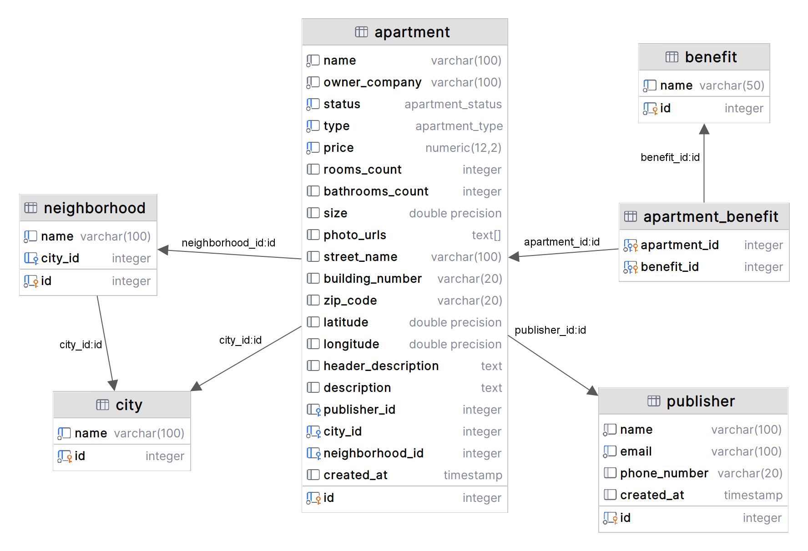

# Apartment Listings Platform - Clean Architecture Implementation


## Table of Contents
1. [Overview](#overview)
2. [Features](#features)
3. [Clean Architecture](#clean-architecture)
4. [Technologies](#technologies)
5. [Database Schema](#database-schema)
6. [API Documentation](#api-documentation)
7. [Screenshots](#screen-shots)
8. [Installation](#installation)

## Overview <a name="overview"></a>
A modern apartment listings platform built with Clean Architecture principles, featuring:

- Next.js frontend
- Node.js backend API
- PostgreSQL database
- Docker containerization

## Features <a name="features"></a>
- Property listing management (CRUD operations)
- Advanced search and filtering
- Multi-step property submission form
- Publisher management system
- Location-based browsing

## Clean Architecture <a name="clean-architecture"></a>
This project follows **Clean Architecture** principles with clear separation of concerns:


Key principles implemented:
- Independent of frameworks
- Testable business rules
- Independent of UI, database, or external agencies
- Dependency Rule: Inner circles can't know about outer circles

## Technologies <a name="technologies"></a>

### Frontend
- Next.js 14
- TypeScript
- Tailwind CSS
- React Hook Form

### Backend
- Node.js 18
- Express
- TypeORM
- PostgreSQL
- JWT Authentication

### Infrastructure
- Docker
- Docker Compose
- Postman (API testing)

## Database Schema <a name="database-schema"></a>


Key Entities:
- `Apartment` - Core property model
- `Neighborhood` - Location hierarchy
- `Publisher` - Listing owners
- `ApartmentBenefit` - Amenities junction table

## API Documentation <a name="api-documentation"></a>
Complete Postman documentation:  
[View API Docs](https://documenter.getpostman.com/view/22778824/2sB2cYdLpw)

## Screen Shots <a name="screen-shots"></a>


## Installation <a name="installation"></a>
```bash
git clone [https://github.com/your-repo/Apartment-system.git](https://github.com/atmoharam/Apartment-system)
cd Apartment-system
docker-compose up --build
